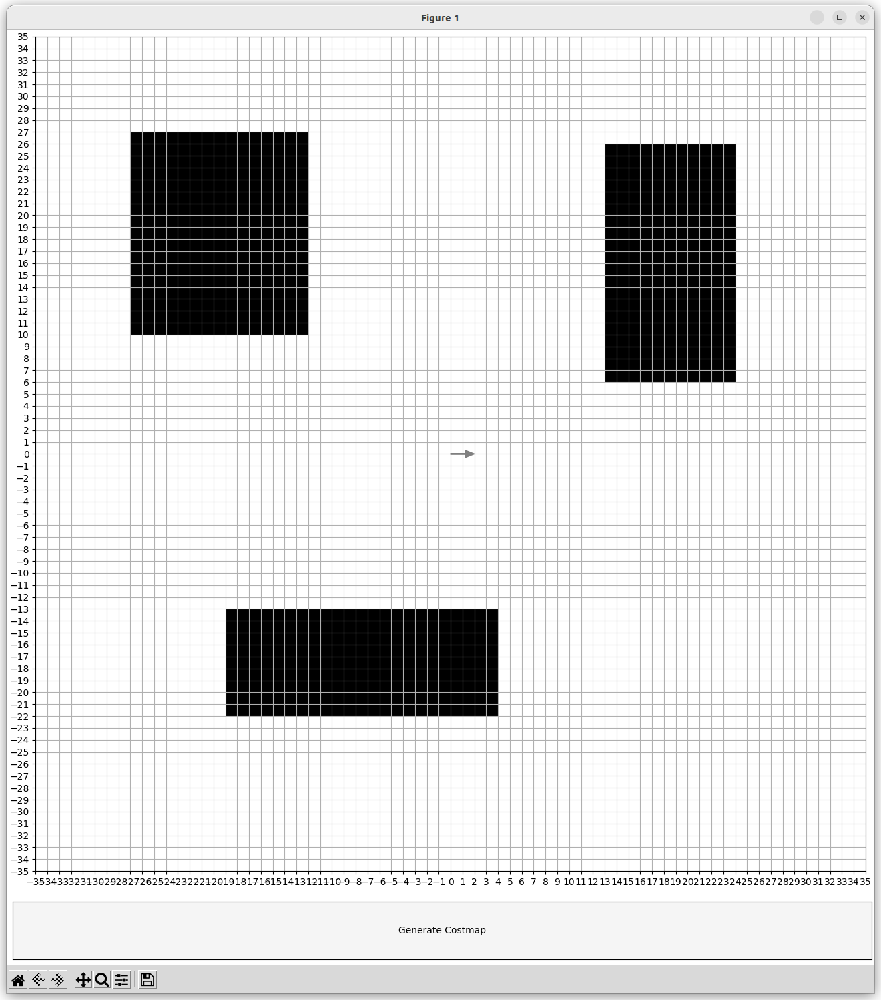

# Debug tools for Python wrapper of freespace planning algorithms

## Setup

1. Build the package

   ```
   colcon build --packages-select freespace_planning_algorithms --symlink-install --cmake-args -DCMAKE_BUILD_TYPE=Release
   ```

2. Source the setup srcript

   ```
   source install/setup.bash
   ```

## Costmap generation

### Usage

1. Run the script `python3 generate_costmap.py --save_name [filename]`
2. Then the GUI shows up
   - Drag and drop to put an obstacle
   - Drag and drop the same points again to remove the obstacle
   - Push "Generate Costmap" button to save the costmap to `costmap/filename.txt`
3. Close the window to finish it



### Options

| Option         | Type   | Description                   | Defualt value     |
| -------------- | ------ | ----------------------------- | ----------------- |
| `--save_name`  | string | file name to save the costmap | costmap_generated |
| `--height`     | int    | height of the costmap         | 350               |
| `--width`      | int    | width of the costmap          | 350               |
| `--resolution` | float  | resolution of the costmap     | 0.2               |

## Search for trajectory to goal on grid

Search for goals on grid: discretized on x, y, yaw axes.

### Usage

1. Run the script

   ```
   python3 search_gridgoal.py --dir_name [save dir name]
   ```

   or execute in parallel using [eos run-many](https://github.com/iory/eos/blob/master/eos/run_many.py)

   ```
   run-many 'python3 search_gridgoal.py --dir_name [save dir name]' -n 10 -j 10
   ```

2. Then the trajectories for goals on grid are searched and saved

### Options

| Option           | Type   | Description                                            | Defualt e       |
| ---------------- | ------ | ------------------------------------------------------ | --------------- |
| `--dir_name`     | string | directory name to save the results                     | default_dir     |
| `--costmap`      | string | costmap name for search, generated in previous section | costmap_default |
| `--x_resolution` | float  | goal grid sersolution of the x axis [m]                | 1.0             |
| `--y_resolution` | float  | goal grid sersolution of the y axis [m]                | 1.0             |
| `--yaw_discrete` | int    | goal discretize number of yaw                          | 10              |

## Visualize the searched results and the trajectories

### Usage

1. Run the script `python3 visualize_trajectories.py --dir_name [save dir name]`
2. Then the two GUIs show up
   - Viewer of the searched trajectories
     - Drag and drop to put a goal in specified direction
     - Drag and drop the same point and direction again to remove the goal
     - Then the trajectories for put goal are shown
       
   - Viewer of the success or failure of the search
     - White, red, and black cells indicate success, fail, and obstacle cell, respectively.
       
3. Close the windows to finish it

### Options

| Option       | Type   | Description                                                       | Defualt e   |
| ------------ | ------ | ----------------------------------------------------------------- | ----------- |
| `--dir_name` | string | directory name to save the results, generated in previous section | default_dir |
